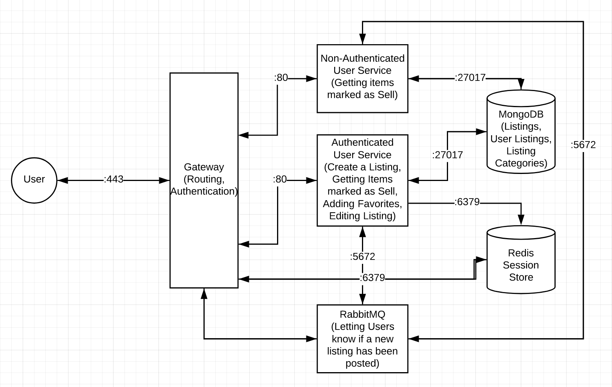

# UW MarketPlace
Brian Do, Molly Li, Justin La

## Project Description

### Target Audience
UWMP is a listing application where UW students or residents within the UDistrict can participate in buy/sell exchanges. The users will be able to post listings in those categories with a specific item type.
### Users
Users may want to use this application because it is an online base where individuals within the same area can sell and buy items locally. In specific scenarios, it can be used to sell furniture when moving out, or getting rid of old clothes that are still in wearable condition. Potential users may want to sell or buy items at a discounted price, look for items that are not available in retail, or make some extra cash. The users will be able to browse selection and create listings. They do this by creating creating an account with simple identifying information. Within a user account, they then have the option to create a listing. Users who do not have an account are unable to post a listing. 
### Developers
As developers we want to create this application because we think it would be a great addition to student life. There is rarely a point where people are not interested in buying/selling/trading things that they have or want, and this would be a platform to mediate those exchanges. The actual transaction is not done over the application and that is attributed to the idea of being local listing application. 

## Technical Description

### Architectural Diagram

### Endpoints
* POST v1/users
	* 201 - Adds user to database - application/json
	* 400 - Incorrect Format
	* 415 - Unsupported media type
* GET v1/listings
	* 200 - returns list of all current listings for sale - application/json
* POST v1/listings
	* 201 - Adds a listing to the database after sign-in
	* 400 - Incorrect Format
	* 415 - Unsupported media type
* GET v1/listings/creator/{creatorID}
	* 200 - Returns all listings of an authenticated user - application/json
	* 403 - Invalid creator ID
* GET v1/listings/{listingID}
	* 200 - Returns a single listing - application/json
	* 403 - Invalid listingID
	* 404 - Non-existent listing
* PATCH v1/listings/{ID}
	* 200 - Edits listing at given ID - application/json
	* 403 - Unauthorized user/invalid listingID
* DELETE v1/listings/{ID}
	* 200 - Deletes listing at given ID
	* 403 - Unauthorized user/invalid listingID

### Database schemas
Listing : {
	ID: string
	Title: string
	Description: string
	Condition: string
	Price: string
	Location: string
	Contact: string
	Creator: string
}

User : {
	ID: string
	UserName: string
}

<!--  -->

|Priority        | User          | Description  |
| ------------- |:-------------:| -----:|
| P0      | Buyer  | I want to view the current listings |
| P1      |  Seller   |   I want to make a new listing to sell my items |
| P2 | Seller  | I want to either edit or delete my listing |

### User Stories
* P0: To get the current listings, a get request to the server would be made in order to send a response that contains the current listings

* P1: We would authenticate without external high level libraries and instead implement user authentication from scratch. To make a listing, there would be a POST request to the server that adds it to the database. 

* P3: The seller can then PATCH to edit the listing or DELETE to remove the listing 
